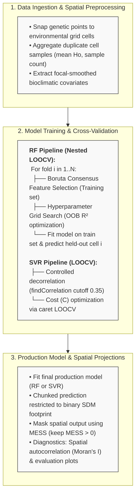

# Spatial Macrogenetics Prediction Workflows (Random Forest & Support Vector Regression)

[](https://www.r-project.org/)
[](https://opensource.org/licenses/MIT)
[](#)

An R pipeline framework for predicting continuous spatial variation in genetic diversity metrics (e.g., observed heterozygosity, $H_o$) across a species' geographic distribution using machine learning models
- Random Forest Regression (ranger) with Boruta feature selection and fully nested Leave-One-Out Cross-Validation (LOOCV).
- Support Vector Regression (svmLinear via caret) with pair-wise decorrelation and Leave-One-Out Cross-Validation (LOOCV).

> [Note]
> Both approaches implement spatial preprocessing, focal smoothing, Leave-One-Out Cross-Validation, and Multivariate Environmental Similarity Surface (MESS) masking to prevent over-extrapolation
---

## Key Features

* **Spatial Processing & Point Aggregation: Automatically snaps out-of-coverage sample coordinates to the nearest valid raster cell (using a 5 km buffer) and aggregates multiple samples falling in the same cell
* **Coastal & Marine Edge Correction: Employs focal spatial smoothing (terra::focal) and nearest-neighbor fallback extractions to avoid NA predictor values at complex coastal edge0* **Strictly Nested LOOCV**: Variable selection (Boruta consensus) and hyperparameter grid searches (`num.trees`, `mtry`, `min.node.size`) are independently executed *within* each cross-validation fold to prevent data leakage from held-out test cells.
* **Flexible Feature Selection & Model Tuning:
	- RF Pipeline: Executes iterative Boruta consensus selection across seeds and nested hyperparameter grid search (num.trees, mtry, min.node.size) strictly within CV folds to prevent data leakage
	- SVR Pipeline: Employs controlled decorrelation (caret::findCorrelation, cutoff = 0.35) combined with cost hyperparameter tuning ($C$) via care
* **Distance Predictors: Supports spatial coordinate distances as predictor variables
* **MESS Interpolation Masking: Computes a Multivariate Environmental Similarity Surface (MESS) to restrict spatial projections strictly to regions of environmental interpolation ($MESS > 0$), masking out novel/extrapolated environmental spaces
* **Spatial Autocorrelation Diagnostics: Assesses spatial dependence in cross-validation residuals using Moran's $I$ with inverse-distance spatial weighting (ape::Moran.I)* **Memory-Efficient Spatial Prediction**: Predicts raster outputs in chunks to manage memory overhead across large high-resolution extents.
* **Memory-Efficient Spatial Prediction: Predicts raster outputs in chunks to manage memory overhead across large high-resolution extents
* **Publication-Ready Exports: Automatically generates performance comparison plots (Train vs. LOOCV), feature importance charts, and high-resolution PDF spatial maps using tmap

---

## Workflow Architecture

---

## Dependencies

Required R packages:

```r
install.packages(c(
  "terra", "sf", "ranger", "patchwork", "dplyr", 
  "ggplot2", "ggpmisc", "tmap", "Boruta", "ape", 
  "RColorBrewer", "readxl", "caret", "raster", "dismo",
  "yardstick", "fields", "adespatial"
))
```

# # Input Requirements
- Genetic Data (Tabla_to_model.xlsx): Excel spreadsheet with a sheet named "data" containing:
- sp: Species scientific name string (e.g., "Crocodylus acutus").
- Ho: Continuous genetic response variable (Observed Heterozygosity).
- lon, lat: Georeferenced sample coordinates in WGS84 (EPSG:4326).
- Environmental Rasters (raster_dir): Directory containing continuous predictor raster layers in standard GeoTIFF format (.tif).
- Binary SDM Raster (sdm_path): A binary Species Distribution Model raster (1 = suitable/presence, 0/NA = unsuitable) to restrict spatial projections.

## Predictor layers:
- Worldclim
- Land use
- Distance to coastline and rivers
- Distances among coordinates

### Usage Example

# Load workflow function

source("RF_LOOCV.R")

# Run execution pipeline

- RF + BORUTA:
```r
source("003_configure_RF_LOOCV_BORUTA.R")

RF_LOOCV(
  outdir           = "path/to/output_dir",
  sp_name          = "Crocodylus acutus",
  raster_dir       = "path/to/raster_dir",
  data_path        = "path/to/genetic_data.xlsx",
  sdm_path         = "path/to/binary_sdm.tif",
  N_CORES          = 8L,   # CPU threads for ranger
  boruta_threshold = 30L,  # Consensus threshold (out of n_seeds runs)
  n_seeds          = 30L   # Number of Boruta runs
)
```
- SVM + LOOCV
```r
source("006_SVR_LOOCV.R")

svr_ho_pipeline(
  outdir     = "path/to/output_dir",
  sp_name    = "Crocodylus acutus",
  raster_dir = "path/to/raster_dir",
  data_path  = "path/to/genetic_data.xlsx",
  sdm_path   = "path/to/binary_sdm.tif",
  n_cores    = 8L,
  cor_cutoff = 0.6,
  addLonLat = T # use lon and lat as predictors
)
```

### Key Methodological References
- Ranger: Wright, M. N., & Ziegler, A. (2017). ranger: A Fast Implementation of Random Forests for High Dimensional Data in C++ and R. Journal of Statistical Software, 77(1), 1–17.
- Boruta: Kursa, M. B., & Rudnicki, W. R. (2010). Feature Selection with the Boruta Package. Journal of Statistical Software, 36(11), 1–13.
- Caret / SVR: Kuhn, M. (2008). Building Predictive Models in R Using the caret Package. Journal of Statistical Software, 28(5), 1–26.
- MESS: Elith, J., Kearney, M., & Phillips, S. (2010). The art of modelling range-shifting species. Methods in Ecology and Evolution, 1(4), 330–342.
- Macrogenetics Framework: Sosa, C.C.; Arenas, C.; García-Merchán, V.H. Human Population Density Influences Genetic Diversity of Two Rattus Species Worldwide: A Macrogenetic Approach. Genes 2023, 14, 1442. https://doi.org/10.3390/genes14071442

# Authors:
Chrystian C. Sosa, Jorge Gómez-Marulanda, Victor Hugo García-Merchán

# IA declaration

This repo was developed with the assistance of the Gemini model adapting the methodology of Sosa et al. (2023) by implementing Leave-One-Out Cross-Validation (LOOCV), optimizing Random Forest/SVR hyperparameters, and integrating automated feature selection