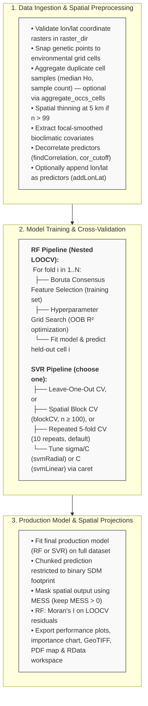

# Spatial Macrogenetics Prediction Workflows (Random Forest & Support Vector Regression)

[](https://www.r-project.org/)
[](https://opensource.org/licenses/MIT)
[](#)

An R pipeline framework for predicting continuous spatial variation in genetic diversity metrics (e.g., observed heterozygosity, $H_o$) across a species' geographic distribution using machine learning models:
- **Random Forest Regression** (`ranger`) with Boruta feature selection and a fully nested Leave-One-Out Cross-Validation (LOOCV).
- **Support Vector Regression** (`svmRadial` or `svmLinear`, via `caret`) with pairwise decorrelation and a choice of Leave-One-Out CV, Spatial Block CV (`blockCV`), or repeated 5-fold CV.

> [!NOTE]
> Both pipelines share the same spatial preprocessing backbone: optional per-cell occurrence aggregation, automatic spatial thinning above 100 points/cells, focal smoothing for coastal predictor extraction, optional inclusion of geographic coordinates (`lon`/`lat`) as predictors, and Multivariate Environmental Similarity Surface (MESS) masking to prevent over-extrapolation.
---

## Key Features

* **Spatial Processing & Optional Point Aggregation**: Automatically snaps out-of-coverage sample coordinates to the nearest valid raster cell (5 km buffer). When `aggregate_occs_cells = TRUE` (default), multiple samples falling in the same cell are aggregated into a single observation (median $H_o$, MAD, sample count, cell-centroid coordinates); when `FALSE`, every occurrence point is modelled individually with no cell-level weighting.
* **Automatic Spatial Thinning**: If more than 99 occurrences/cells remain after aggregation, points are spatially thinned to a 5 km minimum nearest-neighbor distance (`spThin`-based `thin()`) before feature selection and model fitting.
* **Coastal & Marine Edge Correction**: Employs focal spatial smoothing (`terra::focal`, 15-cell window) and nearest-valid-pixel fallback extraction to avoid NA predictor values at complex coastal/marine edges.
* **Strictly Nested LOOCV (RF Pipeline)**: Boruta variable selection and hyperparameter grid search (`num.trees`, `mtry`, `min.node.size`) are independently re-executed *within* every cross-validation fold to prevent data leakage from held-out cells.
* **Flexible Feature Selection & Model Tuning**:
	- RF Pipeline: Iterative Boruta consensus selection across `n_seeds` runs (a variable is retained once it is "Confirmed" in at least `boruta_threshold` seeds) plus a nested hyperparameter grid search (`num.trees`, `mtry`, `min.node.size`) optimizing OOB $R^2$, strictly within each CV fold.
	- SVR Pipeline: Configurable pairwise decorrelation (`caret::findCorrelation`, `cor_cutoff`, default `0.5`) combined with `caret::train` hyperparameter tuning (sigma × cost `C` for `svmRadial`, or cost `C` alone for `svmLinear`).
* **Multiple Cross-Validation Schemes (SVR Pipeline)**: Choose Leave-One-Out CV (`use_loocv = TRUE`), Spatial Block CV via `blockCV` (`use_blockcv = TRUE`, requires ≥ 100 samples, otherwise the scenario is skipped), or repeated 5-fold CV (10 repeats) as the default when neither flag is set.
* **Optional Geographic Coordinate Predictors**: Both pipelines can include `lon`/`lat` as candidate predictors (`addLonLat = TRUE`), subject to the same feature-selection procedure as the environmental covariates. Coordinate raster layers named `lon`/`lat` must always be present in `raster_dir`, regardless of this setting (see Input Requirements).
* **MESS Interpolation Masking**: Computes a Multivariate Environmental Similarity Surface (`dismo::mess`) to restrict spatial projections strictly to regions of environmental interpolation ($MESS > 0$), masking out novel/extrapolated environmental space.
* **Spatial Autocorrelation Diagnostics (RF Pipeline)**: Assesses spatial dependence in LOOCV residuals using Moran's $I$ with row-standardized inverse-distance spatial weights (`ape::Moran.I`).
* **Memory-Efficient Spatial Prediction**: Predicts raster outputs in chunks to manage memory overhead across large, high-resolution extents.
* **Publication-Ready Exports**: Automatically generates performance comparison plots (Train vs. CV test), feature-importance charts, prediction rasters (GeoTIFF), high-resolution PDF spatial maps (`tmap`), and a saved `.RData` workspace image per run.

---

## Workflow Architecture

---

## Dependencies

Required R packages:

```r
install.packages(c(
  "terra", "sf", "ranger", "patchwork", "dplyr",
  "ggplot2", "ggpmisc", "tmap", "Boruta", "ape",
  "RColorBrewer", "readxl", "caret", "raster", "dismo",
  "yardstick", "doParallel", "kernlab", "blockCV",
  "spThin", "units"
))
```

# # Input Requirements
- Genetic Data (Tabla_to_model.xlsx): Excel spreadsheet with a sheet named "data" containing:
- sp: Species scientific name string (e.g., "Crocodylus acutus").
- Ho: Continuous genetic response variable (Observed Heterozygosity, must be > 0).
- lon, lat: Georeferenced sample coordinates in WGS84 (EPSG:4326).
- Environmental Rasters (raster_dir): Directory containing continuous predictor raster layers in standard GeoTIFF format (.tif). **Must include two coordinate layers named exactly `lon` and `lat`** — both pipelines validate their presence at start-up and stop with an error if either is missing, regardless of whether `addLonLat` is enabled.
- Binary SDM Raster (sdm_path): A binary Species Distribution Model raster (1 = suitable/presence, 0/NA = unsuitable) to restrict spatial projections.

## Predictor layers:
- Worldclim
- Land use
- Distance to coastline and rivers
- Geographic coordinates (`lon`, `lat` rasters — required input; used as predictors only when `addLonLat = TRUE`)

### Usage Example

Each script is self-contained — source the one matching the model you want to run.

- RF + BORUTA:
```r
source("003_configure_RF_LOOCV_BORUTA.R")

RF_LOOCV(
  outdir               = "path/to/output_dir",
  sp_name              = "Crocodylus acutus",
  raster_dir           = "path/to/raster_dir",
  data_path            = "path/to/genetic_data.xlsx",
  sdm_path             = "path/to/binary_sdm.tif",
  N_CORES              = 8L,    # CPU threads for ranger
  boruta_threshold     = 30L,   # Consensus threshold (out of n_seeds runs)
  n_seeds              = 30L,   # Number of Boruta runs
  cor_cutoff           = 0.5,   # Pairwise correlation cutoff for decorrelation
  addLonLat            = TRUE,  # Use lon/lat as candidate predictors
  aggregate_occs_cells = TRUE   # Aggregate occurrences per raster cell
)
```
- SVM + LOOCV / BlockCV / Repeated CV
```r
source("006_SVR_LOOCV.R")

svr_ho_pipeline(
  outdir               = "path/to/output_dir",
  sp_name              = "Crocodylus acutus",
  raster_dir           = "path/to/raster_dir",
  data_path            = "path/to/genetic_data.xlsx",
  sdm_path             = "path/to/binary_sdm.tif",
  n_cores              = 8L,
  cor_cutoff           = 0.5,
  addLonLat            = TRUE,        # use lon and lat as predictors
  use_loocv            = TRUE,        # set FALSE + use_blockcv = TRUE for Spatial Block CV,
                                       # or leave both FALSE for repeated 5-fold CV
  use_blockcv          = FALSE,
  kernel_type          = "svmRadial", # or "svmLinear"
  aggregate_occs_cells = TRUE
)
```

### Key Methodological References
- Ranger: Wright, M. N., & Ziegler, A. (2017). ranger: A Fast Implementation of Random Forests for High Dimensional Data in C++ and R. Journal of Statistical Software, 77(1), 1–17.
- Boruta: Kursa, M. B., & Rudnicki, W. R. (2010). Feature Selection with the Boruta Package. Journal of Statistical Software, 36(11), 1–13.
- Caret / SVR: Kuhn, M. (2008). Building Predictive Models in R Using the caret Package. Journal of Statistical Software, 28(5), 1–26.
- MESS: Elith, J., Kearney, M., & Phillips, S. (2010). The art of modelling range-shifting species. Methods in Ecology and Evolution, 1(4), 330–342.
- Macrogenetics Framework: Sosa, C.C.; Arenas, C.; García-Merchán, V.H. Human Population Density Influences Genetic Diversity of Two Rattus Species Worldwide: A Macrogenetic Approach. Genes 2023, 14, 1442. https://doi.org/10.3390/genes14071442

# Authors:
Chrystian C. Sosa, Jorge Gómez-Marulanda, Victor Hugo García-Merchán

# IA declaration

This repo was developed with the assistance of the Gemini model adapting the methodology of Sosa et al. (2023) by implementing Leave-One-Out Cross-Validation (LOOCV), optimizing Random Forest/SVR hyperparameters, and integrating automated feature selection
