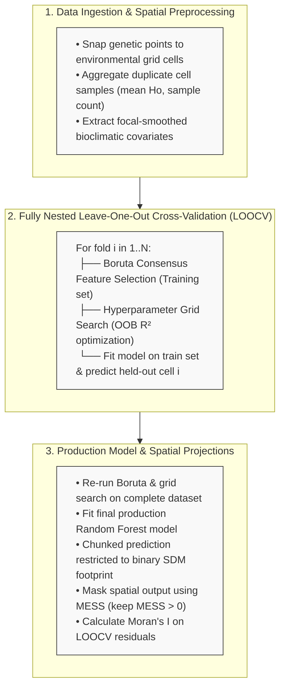

# Spatial Macrogenetics Prediction Workflow (Random Forest via `ranger`)

[](https://www.r-project.org/)
[](https://opensource.org/licenses/MIT)
[](#)

An R pipeline for predicting continuous spatial variation in genetic diversity metrics (e.g., observed heterozygosity, $H_o$) across a species' geographic distribution using Random Forest regression (`ranger`), feature selection via Boruta, nested Leave-One-Out Cross-Validation (LOOCV), and Multivariate Environmental Similarity Surface (MESS) masking.

---

## Key Features

* **Spatial Processing & Point Aggregation**: Automatically snaps out-of-coverage sample coordinates to the nearest valid raster cell (using a 5 km buffer) and aggregates multiple samples falling in the same cell.
* **Coastal & Marine Edge Correction**: Employs focal spatial smoothing (`terra::focal`) and nearest-neighbor fallback extractions to avoid `NA` predictor values at complex coastal edges.
* **Strictly Nested LOOCV**: Variable selection (Boruta consensus) and hyperparameter grid searches (`num.trees`, `mtry`, `min.node.size`) are independently executed *within* each cross-validation fold to prevent data leakage from held-out test cells.
* **MESS Interpolation Masking**: Computes a Multivariate Environmental Similarity Surface (MESS) to restrict spatial projections strictly to regions of environmental interpolation ($MESS > 0$), masking out novel/extrapolated environmental spaces.
* **Spatial Autocorrelation Diagnostics**: Assesses spatial dependence in cross-validation residuals using Moran's $I$ with inverse-distance spatial weighting (`ape::Moran.I`).
* **Memory-Efficient Spatial Prediction**: Predicts raster outputs in chunks to manage memory overhead across large high-resolution extents.
* **Publication-Ready Exports**: Automatically generates performance comparison plots (Train vs. LOOCV), permutation-based variable importance charts, and high-resolution PDF spatial maps using `tmap`.

---

## Workflow Architecture

---

## Dependencies

Required R packages:

```r
install.packages(c(
  "terra", "sf", "ranger", "patchwork", "dplyr", 
  "ggplot2", "ggpmisc", "tmap", "Boruta", "ape", 
  "RColorBrewer", "readxl", "caret", "raster", "dismo"
))
```

# # Input Requirements
- Genetic Data (Tabla_to_model.xlsx): Excel spreadsheet with a sheet named "data" containing:
- sp: Species scientific name string (e.g., "Crocodylus acutus").
- Ho: Continuous genetic response variable (Observed Heterozygosity).
- lon, lat: Georeferenced sample coordinates in WGS84 (EPSG:4326).
- Environmental Rasters (raster_dir): Directory containing continuous predictor raster layers in standard GeoTIFF format (.tif).
- Binary SDM Raster (sdm_path): A binary Species Distribution Model raster (1 = suitable/presence, 0/NA = unsuitable) to restrict spatial projections.

### Usage Example

# Load workflow function
source("RF_LOOCV.R")

# Run execution pipeline
```r
RF_LOOCV(
  outdir           = "path/to/output_dir",
  sp_name          = "Crocodylus acutus",
  raster_dir       = "path/to/raster_dir",
  data_path        = "path/to/genetic_data.xlsx",
  sdm_path         = "path/to/binary_sdm.tif",
  N_CORES          = 6L,   # Number of CPU threads for ranger
  boruta_threshold = 10L,  # Consensus threshold (e.g., 10/10 runs)
  n_seeds          = 10L   # Number of Boruta runs per iteration
)
```


###Key Methodological References
- Ranger: Wright, M. N., & Ziegler, A. (2017). ranger: A Fast Implementation of Random Forests for High Dimensional Data in C++ and R. Journal of Statistical Software, 77(1), 1–17.
- Boruta: Kursa, M. B., & Rudnicki, W. R. (2010). Feature Selection with the Boruta Package. Journal of Statistical Software, 36(11), 1–13.
- MESS: Elith, J., Kearney, M., & Phillips, S. (2010). The art of modelling range-shifting species. Methods in Ecology and Evolution, 1(4), 330–342.
- Sosa, C.C.; Arenas, C.; García-Merchán, V.H. Human Population Density Influences Genetic Diversity of Two Rattus Species Worldwide: A Macrogenetic Approach. Genes 2023, 14, 1442. https://doi.org/10.3390/genes14071442


# Authors:
Chrystian C. Sosa, Jorge Gómez-Marulanda, Victor Hugo García-Merchán